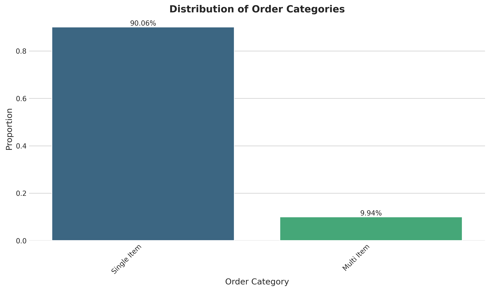
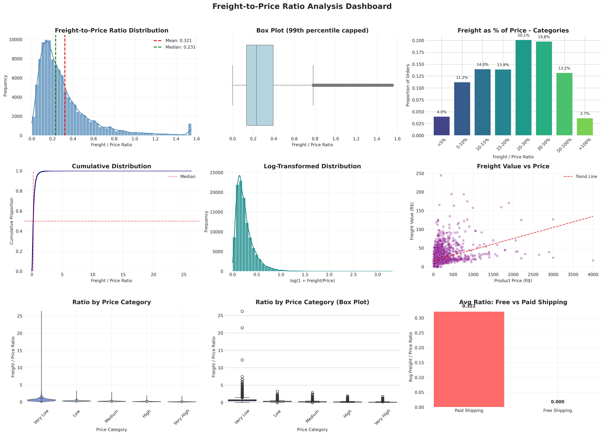
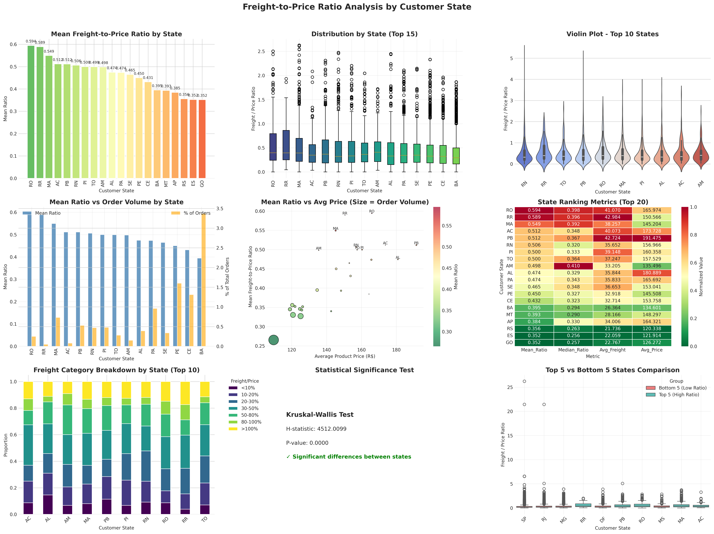

# Olist E-Commerce — Python Analysis Notebook
**Project:** Olist E-Commerce Dataset | Quantify Analytics Labs  
**Author:** Peter Mchikho  
**Dataset Period:** September 2016 – August 2018 (99,441 orders)

> This document is a living analytical record. Each section answers one business
> question using Python, with findings, visualisations, and methodology documented
> as they are completed.

---

## Table of Contents

| # | Business Question | Status |
|---|---|---|
| [Q1](#q1-month-on-month-trend-in-total-orders-and-gmv) | What is the month-on-month trend in total orders and GMV over the full dataset period? |  Complete |
| [Q2](#q2-seasonal-peaks-and-year-over-year-growth) | Which months exhibit the strongest seasonal peaks, and what is the year-over-year growth rate? |  Complete |
| [Q3](#q3-single-item-vs-multi-item-order-analysis) | What proportion of orders are single-item versus multi-item, and how does basket size correlate with total order value? |  Complete |
| [Q4](#q4-freight-to-price-ratio-distribution-by-state) | What is the distribution of freight value relative to product price, and how does this vary by customer state? |  Complete |
| [Q5](#q5-order-processing-time-analysis) | What is the average order processing time (purchase to approval) and how has it trended over the dataset period? |  Complete |
| [Q6](#q6-gmv-concentration-by-order-value) | What share of total GMV is concentrated in the top 10% of orders by value, and what product categories drive that concentration? |  Complete |

---

## Q1: Month-on-Month Trend in Total Orders and GMV

**Date Completed:** June 2026  
**Query Reference:** `ql_olist_query_02_monthly_gmv.sql`

### Objective

Understand how order volume and Gross Merchandise Value (GMV) evolved month by month
across the full dataset period, decomposed into product revenue and freight revenue,
to establish the platform's growth trajectory and identify key inflection points.

---

### Dashboard


---

### Key Findings

**Overall Growth**  
The platform scaled from just 3 orders and R$355 GMV in September 2016 to a sustained
monthly run rate of 6,000–7,500 orders generating over R$1M GMV by early 2018 — roughly
a 3,000x increase in GMV across the two-year window.

**Peak Month — November 2017 (Black Friday)**  
The single highest-volume month was November 2017, driven by Brazil's Black Friday
campaign. It recorded 7,451 orders and R$1,179,144 GMV — the only month to breach the
R$1M ceiling before 2018, and clearly visible as an outlier spike in both the Orders
Trend and GMV Trend charts.

**Sustained Scale in 2018**  
From January through August 2018, monthly GMV consistently exceeded R$1M, confirming
that the November 2017 spike translated into durable platform growth rather than a
one-off event. The range across this period was R$987K (June 2018) to R$1,160K
(March 2018).

**Freight as a Stable Share of GMV**  
Freight revenue tracked product revenue closely throughout, averaging approximately
14–16% of GMV each month. This consistency indicates a stable cost-pass-through
structure — freight pricing scales proportionally with order value rather than being
compressed or inflated by volume changes.

**Data Cutoff Artefact**  
September 2018 shows a single order (R$166 GMV), and December 2016 shows only 1 order.
These are dataset boundary artefacts, not business events, and are excluded from
trend modelling.


---

## Q2: Seasonal Peaks and Year-over-Year Growth

**Date Completed:** June 2026

### Objective

Identify which months exhibit the strongest seasonal peaks in order volume and GMV,
and quantify the year-over-year growth rate between 2017 and 2018 on a like-for-like
monthly basis.

---

### Analytical Decision — Subset Selection

A full dataset YoY comparison is not valid here because the years have unequal coverage:
2017 spans January–December while 2018 is complete only through August. Comparing full-year
totals would systematically understate 2018 performance. The analysis was therefore
restricted to **January–August**, the only window with complete data in both years.
September–December 2017 and the boundary artefact months (Sep 2016, Dec 2016, Sep 2018)
are excluded from all YoY calculations.

---

### Visualisations


---

### Key Findings

**Strongest Seasonal Peak — November 2017 (Black Friday)**  
November 2017 recorded the sharpest single-month MoM acceleration in the dataset: orders
jumped +63% and GMV surged +53% from October. This is the dominant seasonal signal in the
data, driven by Brazil's Black Friday campaign, and stands as a clear outlier relative to
all other months.

**Post-Peak Correction is Normal**  
December 2017 saw a sharp MoM pullback of -25% in orders and -27% in GMV — a natural
demand hangover following the Black Friday spike. This pattern is consistent with
post-promotional normalisation rather than structural decline.

**Early-Year Acceleration in 2017**  
January–March 2017 showed the strongest sustained MoM growth in the dataset: +120%,
+53%, and +52% in GMV respectively. This reflects the platform still in its hyper-growth
phase, building volume from a low base.

**2018 Operating at Maturity**  
By 2018, MoM swings narrowed to single digits for most months (±1% to ±17%), indicating
the platform had reached a more stable operating rhythm. Growth was real but decelerating,
consistent with a maturing marketplace.

**Year-over-Year Growth — Early Months Dominate**  
The strongest YoY gains were concentrated in the first half of the year, driven by 2017's
low base:

| Month | Orders YoY | GMV YoY |
|-------|-----------|---------|
| Jan   | +815%     | +707%   |
| Feb   | +286%     | +245%   |
| Mar   | +172%     | +167%   |
| Apr   | +190%     | +181%   |
| May   | +87%      | +96%    |
| Jun   | +91%      | +103%   |
| Jul   | +58%      | +81%    |
| Aug   | +50%      | +50%    |

January's +815% order growth and +707% GMV growth are technically accurate but reflect
near-zero January 2017 volumes (789 orders) rather than a genuine seasonal acceleration
in 2018. Growth rates compress steadily through the year as 2017 comparables strengthen.

**GMV Growth Outpacing Order Growth in Mid-Year**  
In May, June, and July, GMV grew faster than orders YoY (e.g. June: +91% orders vs +103%
GMV), suggesting average order values were rising — buyers were spending more per
transaction in 2018 than in equivalent months of 2017.

---

### Python Approach

MoM growth computed via `pct_change()` on the chronologically sorted monthly aggregate,
with boundary artefact months filtered out (`total_orders >= 400`) before calculation to
prevent distorted growth rates from 1–3 order months. YoY comparison built by pivoting
the same dataframe on year, joining on month index, and computing percentage change
between the two year columns directly.

---

## Q3: Single-Item vs Multi-Item Order Analysis

**Date Completed:** June 2026  
**Analysis Reference:** `basket_size_correlation_analysis.py`

### Objective

Determine the proportion of orders that contain a single item versus multiple items,
and quantify the relationship between basket size (multi-item vs single-item) and
Gross Merchandise Value (GMV). This analysis helps understand customer purchasing
behavior and its impact on revenue.

---

### Visualisation



---

### Key Findings

**Order Distribution — Single-Item Dominance**  
The overwhelming majority of orders (90.06%) consist of a single item, while only
9.94% contain multiple items. This 9:1 ratio indicates that customers predominantly
use the platform for single-product purchases, suggesting:
- The platform functions primarily as a destination for specific item needs
- Cross-selling and bundling opportunities remain largely untapped
- Customer behaviour is heavily skewed toward convenience-focused, single-item transactions

**Correlation with GMV — Weak but Significant**  
The point-biserial correlation between multi-item orders and GMV is 0.1343 (p < 0.001),
indicating a weak but statistically significant positive relationship. Multi-item orders
tend to generate higher GMV than single-item orders, though the correlation strength
suggests basket size alone explains only a small portion of GMV variation.

**Statistical Significance**  
With a p-value of 0.0000 (p < 0.001), we can confidently reject the null hypothesis of
no correlation. This pattern is real and not attributable to random chance, even though
the effect size is modest.

---

### Business Implications

**Growth Opportunity in Basket Expansion**  
Given that only 1 in 10 orders currently includes multiple items, there is substantial
room to increase average order value through:
- **Product Recommendations**: Implementing "Frequently Bought Together" suggestions
- **Bundle Offers**: Creating discounted product bundles for complementary items
- **Threshold Incentives**: Offering free shipping or discounts above a cart value

**Targeted Marketing Strategies**  
- **Single-Item Customers (90%)**: Engage with post-purchase recommendations for
  complementary products; encourage exploration of product categories
- **Multi-Item Customers (10%)**: Recognize with loyalty rewards; analyse their
  purchase patterns to identify high-potential product combinations

**Understanding GMV Drivers**  
The weak correlation (0.1343) indicates that while multi-item orders do contribute
to higher GMV, other factors — such as product price points, customer segments,
seasonal promotions, and purchase frequency — likely play a more significant role
in determining overall GMV. Basket size expansion should be pursued alongside
strategies addressing these other drivers.

---

### Limitations and Caveats

1. **Correlation vs Causation**: The observed correlation does not imply that creating
   multi-item orders will necessarily increase GMV. Other confounding factors may
   influence both variables.
2. **Product Price Effects**: This analysis does not account for differences in item
   prices between single and multi-item orders. Multi-item orders could have higher
   GMV simply because they include more expensive products.
3. **Customer Segmentation**: The analysis does not distinguish between customer types
   (new vs returning, high-value vs low-value), which could provide deeper insights.
4. **Temporal Factors**: Seasonality and promotions may influence basket size patterns
   differently across time periods.

---

### Recommended Next Steps

1. **Product Affinity Analysis**  
   Identify which product categories are most frequently purchased together to inform
   bundling and cross-selling strategies.

2. **Customer Segmentation Deep Dive**  
   Analyse basket size patterns across customer segments to tailor interventions
   (e.g., first-time buyers vs loyal customers, geographic regions).

3. **A/B Testing**  
   Design experiments to test the impact of cross-selling recommendations and bundle
   offers on basket size and GMV.

4. **Price Point Analysis**  
   Investigate whether multi-item orders consist of lower-priced items (causing the
   weak correlation) or higher-priced items (suggesting premium customers tend to
   buy multiple items).

5. **Time-Series Analysis**  
   Examine how basket size trends have evolved over the dataset period to identify
   seasonal patterns or shifts in customer behaviour.

---

### Python Implementation

The analysis used the following methodology:

1. **Classification**: Orders were classified as single-item or multi-item based on
   the count of unique products in each order.

2. **Distribution Analysis**: Proportions calculated using `value_counts(normalize=True)`
   on the classified orders.

3. **Correlation Testing**: Point-biserial correlation (specifically for binary vs
   continuous variables) was computed using `scipy.stats.pointbiserialr()`.

4. **Visualisation**: Bar chart created with seaborn, using distinct colours for
   single-item (red) and multi-item (teal) categories, with percentage labels
   displayed on each bar.

---

## Q4: Freight-to-Price Ratio Distribution by State

**Date Completed:** June 2026  

### Objective

Analyse the distribution of freight costs relative to product prices across all orders,
and examine how this relationship varies by customer state. This analysis helps
understand regional variations in shipping costs and their impact on customer economics.

---

### Visualisations





---

### Key Findings — Overall Distribution

**Typical Freight-to-Price Ratio**  
The mean freight-to-price ratio is 0.32 (32% of product price), with a median of 0.23
(23%). The distribution is heavily right-skewed (skewness = 11.79), indicating that
while most orders have moderate freight ratios, a small number of orders have extremely
high freight costs relative to product price—up to 26x the product price in extreme cases.

**Distribution by Category**  

| Freight as % of Price | Proportion of Orders |
|----------------------|---------------------|
| < 5%                 | 4.01%               |
| 5-10%                | 11.25%              |
| 10-15%               | 13.99%              |
| 15-20%               | 13.93%              |
| 20-30%               | 20.14%              |
| 30-50%               | 19.81%              |
| 50-100%              | 13.20%              |
| > 100%               | 3.67%               |

**Key Observations:**
- **Most Common Range**: 20-30% of product price (20.14% of orders)
- **Majority of Orders**: 79.25% have freight costs below 50% of product price
- **Extreme Cases**: 3.67% of orders have freight costs exceeding product price
- **Free Shipping**: A small proportion of orders have zero freight (promotional)

---

### Key Findings — By Customer State

**Significant Geographic Variation**  
Freight-to-price ratios vary dramatically across Brazilian states, ranging from a low
of 0.265 (SP) to a high of 0.594 (RO)—a 2.2x difference between the highest and lowest
states. This reflects substantial regional disparities in shipping economics.

**Statistical Significance**  
Kruskal-Wallis test confirms statistically significant differences in freight ratios
across states (p < 0.001), validating that state-level variation is real and not due
to random chance.

---

### State-Level Rankings

**Top 10 States (Highest Freight-to-Price Ratio):**

| Rank | State | Mean Ratio | Median Ratio | % of Orders | Avg Price (R$) |
|------|-------|------------|--------------|-------------|----------------|
| 1 | RO | 0.5942 | 0.3983 | 0.25% | 165.97 |
| 2 | RR | 0.5890 | 0.3957 | 0.05% | 150.57 |
| 3 | MA | 0.5493 | 0.3922 | 0.73% | 145.20 |
| 4 | AC | 0.5117 | 0.3484 | 0.08% | 173.73 |
| 5 | PB | 0.5116 | 0.3674 | 0.53% | 191.48 |
| 6 | RN | 0.5063 | 0.3200 | 0.47% | 156.97 |
| 7 | PI | 0.4998 | 0.3329 | 0.48% | 160.36 |
| 8 | TO | 0.4995 | 0.3643 | 0.28% | 157.53 |
| 9 | AM | 0.4981 | 0.4098 | 0.15% | 135.50 |
| 10 | AL | 0.4745 | 0.3291 | 0.39% | 180.89 |

**Bottom 10 States (Lowest Freight-to-Price Ratio):**

| Rank | State | Mean Ratio | Median Ratio | % of Orders | Avg Price (R$) |
|------|-------|------------|--------------|-------------|----------------|
| 18 | RS | 0.3558 | 0.2629 | 5.53% | 120.34 |
| 19 | ES | 0.3523 | 0.2564 | 2.00% | 121.91 |
| 20 | GO | 0.3516 | 0.2570 | 2.07% | 126.27 |
| 21 | SC | 0.3460 | 0.2544 | 3.71% | 124.65 |
| 22 | PR | 0.3450 | 0.2559 | 5.10% | 119.00 |
| 23 | DF | 0.3431 | 0.2483 | 2.14% | 125.77 |
| 24 | MS | 0.3400 | 0.2509 | 0.73% | 142.63 |
| 25 | MG | 0.3304 | 0.2461 | 11.65% | 120.75 |
| 26 | RJ | 0.3273 | 0.2452 | 12.94% | 125.12 |
| 27 | SP | 0.2654 | 0.1933 | 42.12% | 109.65 |

---

### Regional Analysis

| Region | Mean Ratio | States | Key Observation |
|--------|------------|--------|-----------------|
| **North** | 0.521 | RO, RR, AM, AC, PA, TO, AP | Highest freight burden—remote locations with limited logistics infrastructure |
| **Northeast** | 0.477 | MA, PB, RN, PI, AL, PE, CE, BA, SE | Second-highest—significant distance from Southeast fulfillment centers |
| **Central-West** | 0.357 | MT, GO, DF, MS | Moderate—mixed performance with some proximity to logistics hubs |
| **South** | 0.349 | RS, SC, PR | Below average—good logistics infrastructure and moderate distances |
| **Southeast** | 0.299 | SP, RJ, MG, ES | Best freight economics—home to major fulfillment centers and dense population |

---

### Geographic Insights

**1. The North-Northeast Disadvantage**  
States in the North (RO, RR, AM, AC) and Northeast (MA, PB, RN, PI) regions face freight-to-price ratios nearly double those of Southeast states. This 2x cost differential represents a significant competitive disadvantage for both sellers and customers in these regions.

**2. São Paulo as the Logistics Hub**  
SP accounts for 42.12% of all orders and has the lowest freight-to-price ratio (0.265), reflecting its position as Brazil's economic and logistics center. The proximity of fulfillment centers and high order density enable efficient shipping economics.

**3. The High-Cost, Low-Volume Paradox**  
States with the highest freight ratios (RO, RR, MA, AC) are also among the smallest markets (0.05-0.73% of orders). This creates a vicious cycle: low volume → higher per-unit logistics costs → higher prices → lower demand. Breaking this cycle requires strategic intervention.

**4. Average Price Correlation**  
States with higher average product prices (PB: R$191, AL: R$181, AC: R$174) tend to have higher freight ratios, suggesting that more expensive products—which should theoretically absorb freight costs better—are actually concentrated in high-freight regions. This may indicate product assortment differences by region.

**5. Freight as a Barrier to Growth**  
The 2.2x variation in freight-to-price ratios means that a product costing R$100 in SP effectively costs R$159 for a customer in RO when freight is included—a 59% effective price increase due to location alone.

---

### Business Implications

**1. Pricing Strategy**
- **State-Based Dynamic Pricing**: Consider adjusting product pricing by state to account for freight cost differentials
- **Freight Pass-Through Optimization**: Evaluate whether full freight pass-through is optimal for high-ratio states
- **Minimum Order Thresholds**: Implement state-specific free shipping thresholds to encourage larger baskets

**2. Fulfillment Network Optimization**
- **Regional Warehouses**: Consider fulfillment centers in the Northeast (e.g., PE, BA) to serve the high-cost North/Northeast corridor
- **Last-Mile Partnerships**: Explore local delivery partnerships in high-ratio states
- **Inventory Allocation**: Stock high-demand items closer to high-freight regions

**3. Marketing and Customer Acquisition**
- **Targeted Incentives**: Offer shipping subsidies in high-ratio states to stimulate demand
- **Regional Promotions**: Design state-specific campaigns that account for freight economics
- **Customer Education**: Communicate total cost transparency to build trust

**4. Seller Economics**
- **Seller Location Incentives**: Encourage sellers to locate in or near high-demand regions
- **Freight Cost Sharing**: Explore hybrid models where platform and sellers share freight costs in high-ratio states
- **Product Assortment Strategy**: Curate product offerings that make economic sense for each region

---

### Case Study: The SP vs RO Differential

| Metric | São Paulo (SP) | Rondônia (RO) | Difference |
|--------|---------------|---------------|------------|
| Mean Freight/Price Ratio | 0.265 | 0.594 | 2.2x |
| % of Total Orders | 42.12% | 0.25% | 168x |
| Average Price (R$) | 109.65 | 165.97 | 1.5x |
| Effective Cost (R$100 item) | R$126.50 | R$159.40 | +26% |

**Interpretation**: A customer in RO pays 26% more in total cost for the same item compared to a customer in SP, purely due to freight economics. This differential represents both a barrier to growth in RO and an opportunity for strategic intervention.

---

### Limitations and Caveats

1. **Product Weight and Dimensions**: The analysis does not directly incorporate product
   physical characteristics, which significantly influence freight costs
2. **Seller Location**: Fulfillment location affects freight costs; orders from closer
   sellers have lower ratios
3. **Promotional Effects**: Free shipping promotions may mask true freight economics
4. **Temporal Factors**: Freight costs may have changed over the dataset period
5. **Sample Size**: Small states (RR, AP, AC) have limited orders, making means less stable

---

### Recommended Next Steps

1. **Warehouse Optimization Analysis**  
   Model optimal warehouse locations to minimize state-level freight ratios while
   maintaining service levels. Priority should be given to the North/Northeast corridor.

2. **Product-Level Deep Dive**  
   Identify specific product categories with consistently high freight-to-price ratios
   for targeted interventions in high-cost states.

3. **Free Shipping Impact Study**  
   Analyse how free shipping thresholds affect both basket size and profitability
   by state, with focus on high-ratio states.

4. **Seller Proximity Analysis**  
   Investigate how seller location relative to customer state affects freight ratios,
   and develop incentives for local seller-customer matching.

5. **Pricing Strategy Development**  
   Design state-specific pricing and shipping strategies to improve competitiveness
   in high-ratio states. Pilot in RO, RR, and MA—the three highest-ratio states.

6. **Regional Expansion Strategy**  
   Evaluate feasibility of establishing fulfillment operations in the Northeast
   (potentially PE or BA) to serve the high-cost North/Northeast market.

---

### Python Implementation

The analysis used the following methodology:

1. **Ratio Calculation**: `freight_value_per_price = freight_value / price` for each
   order item.

2. **Distribution Analysis**: Summary statistics, percentiles, and categorical
   breakdown using `pd.cut()` with defined bins.

3. **State-Level Aggregation**: Grouped by `customer_state` to calculate state-specific
   mean, median, standard deviation, and other metrics.

4. **Statistical Testing**: Kruskal-Wallis test to validate significance of state-level
   differences (p < 0.001).

5. **Regional Classification**: States grouped into five Brazilian regions (North,
   Northeast, Central-West, South, Southeast) for higher-level analysis.

6. **Visualisation**: Comprehensive dashboard with histograms, box plots, violin plots,
   and geographic-style visualisations.


## Update Table of Contents

Update your Table of Contents to include the new questions:

```markdown
## Table of Contents

| # | Business Question | Status |
|---|---|---|
| [Q1](#q1-month-on-month-trend-in-total-orders-and-gmv) | What is the month-on-month trend in total orders and GMV over the full dataset period? |  Complete |
| [Q2](#q2-seasonal-peaks-and-year-over-year-growth) | Which months exhibit the strongest seasonal peaks, and what is the year-over-year growth rate? |  Complete |
| [Q3](#q3-single-item-vs-multi-item-order-analysis) | What proportion of orders are single-item versus multi-item, and how does basket size correlate with total order value? |  Complete |
| [Q4](#q4-freight-to-price-ratio-distribution-by-state) | What is the distribution of freight value relative to product price, and how does this vary by customer state? |  Complete |
| [Q5](#q5-order-processing-time-analysis) | What is the average order processing time (purchase to approval) and how has it trended over the dataset period? |  Complete |
| [Q6](#q6-gmv-concentration-by-order-value) | What share of total GMV is concentrated in the top 10% of orders by value, and what product categories drive that concentration? |  Complete |