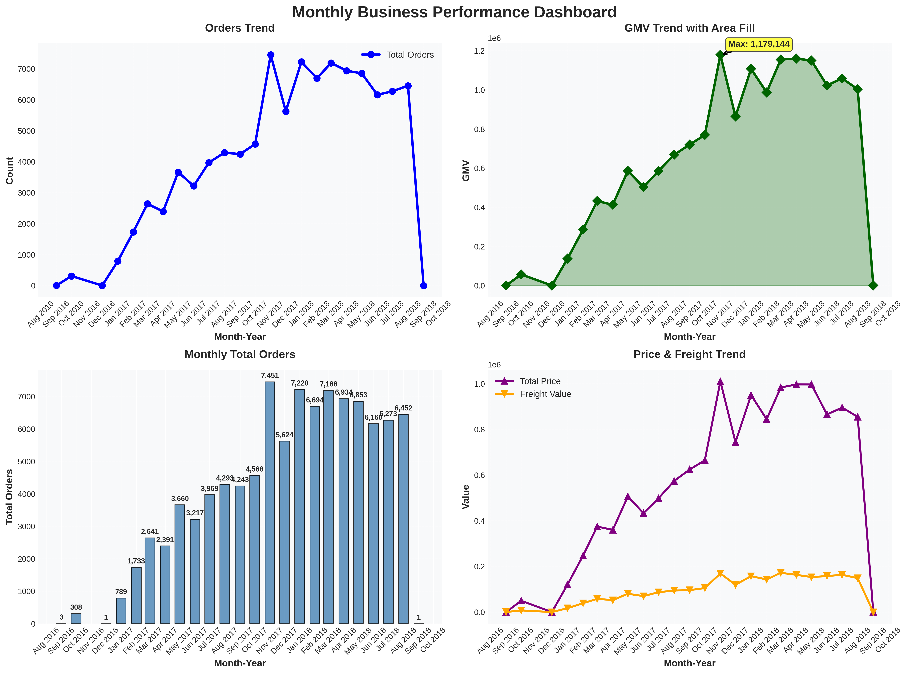
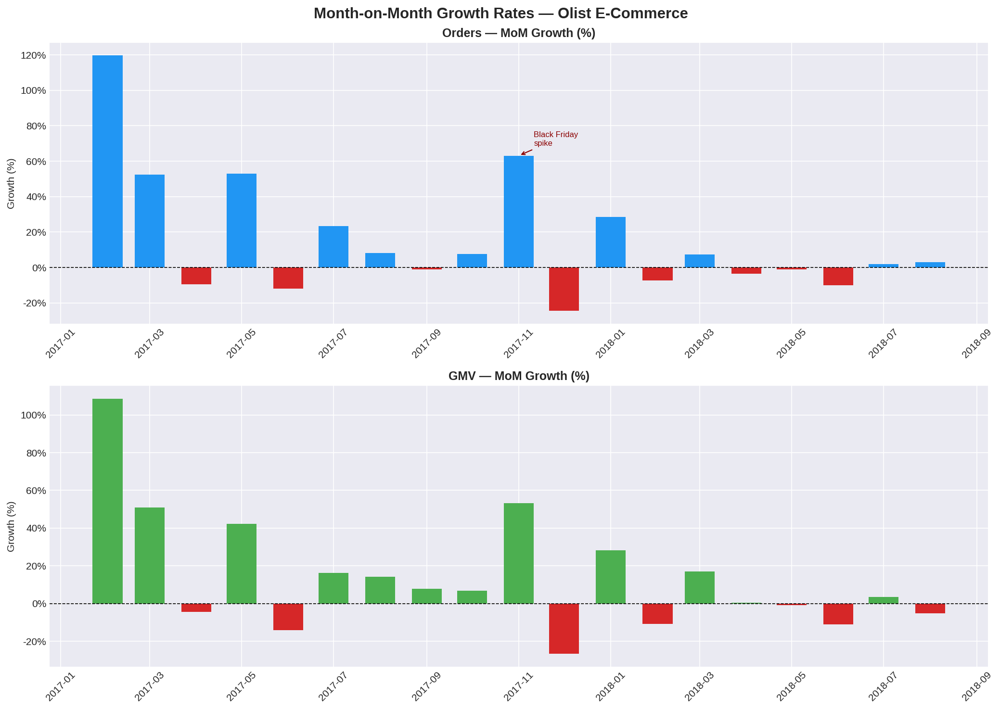
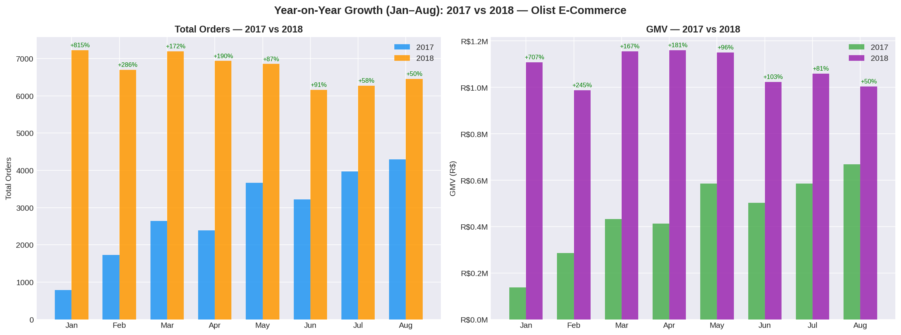

# Olist E-Commerce — Python Analysis Notebook
**Project:** Olist E-Commerce Dataset | Quantify Analytics Labs  
**Author:** Peter Mchikho  
**Dataset Period:** September 2016 – August 2018 (99,441 orders)

> This document is a living analytical record. Each section answers one business
> question using Python, with findings, visualisations, and methodology documented
> as they are completed.

---

## Table of Contents

| # | Business Question | Status |
|---|---|---|
| [Q1](#q1-month-on-month-trend-in-total-orders-and-gmv) | What is the month-on-month trend in total orders and GMV over the full dataset period? |  Complete |
| [Q2](#q2-seasonal-peaks-and-year-over-year-growth) | Which months exhibit the strongest seasonal peaks, and what is the year-over-year growth rate? |  Complete |

---

## Q1: Month-on-Month Trend in Total Orders and GMV

**Date Completed:** June 2026  
**Query Reference:** `ql_olist_query_02_monthly_gmv.sql`

### Objective

Understand how order volume and Gross Merchandise Value (GMV) evolved month by month
across the full dataset period, decomposed into product revenue and freight revenue,
to establish the platform's growth trajectory and identify key inflection points.

---

### Dashboard

---

### Key Findings

**Overall Growth**  
The platform scaled from just 3 orders and R$355 GMV in September 2016 to a sustained
monthly run rate of 6,000–7,500 orders generating over R$1M GMV by early 2018 — roughly
a 3,000x increase in GMV across the two-year window.

**Peak Month — November 2017 (Black Friday)**  
The single highest-volume month was November 2017, driven by Brazil's Black Friday
campaign. It recorded 7,451 orders and R$1,179,144 GMV — the only month to breach the
R$1M ceiling before 2018, and clearly visible as an outlier spike in both the Orders
Trend and GMV Trend charts.

**Sustained Scale in 2018**  
From January through August 2018, monthly GMV consistently exceeded R$1M, confirming
that the November 2017 spike translated into durable platform growth rather than a
one-off event. The range across this period was R$987K (June 2018) to R$1,160K
(March 2018).

**Freight as a Stable Share of GMV**  
Freight revenue tracked product revenue closely throughout, averaging approximately
14–16% of GMV each month. This consistency indicates a stable cost-pass-through
structure — freight pricing scales proportionally with order value rather than being
compressed or inflated by volume changes.

**Data Cutoff Artefact**  
September 2018 shows a single order (R$166 GMV), and December 2016 shows only 1 order.
These are dataset boundary artefacts, not business events, and are excluded from
trend modelling.

---

## Q2: Seasonal Peaks and Year-over-Year Growth

**Date Completed:** June 2026

### Objective

Identify which months exhibit the strongest seasonal peaks in order volume and GMV,
and quantify the year-over-year growth rate between 2017 and 2018 on a like-for-like
monthly basis.

---

### Analytical Decision — Subset Selection

A full dataset YoY comparison is not valid here because the years have unequal coverage:
2017 spans January–December while 2018 is complete only through August. Comparing full-year
totals would systematically understate 2018 performance. The analysis was therefore
restricted to **January–August**, the only window with complete data in both years.
September–December 2017 and the boundary artefact months (Sep 2016, Dec 2016, Sep 2018)
are excluded from all YoY calculations.

---

### Visualisations

---

### Key Findings

**Strongest Seasonal Peak — November 2017 (Black Friday)**  
November 2017 recorded the sharpest single-month MoM acceleration in the dataset: orders
jumped +63% and GMV surged +53% from October. This is the dominant seasonal signal in the
data, driven by Brazil's Black Friday campaign, and stands as a clear outlier relative to
all other months.

**Post-Peak Correction is Normal**  
December 2017 saw a sharp MoM pullback of -25% in orders and -27% in GMV — a natural
demand hangover following the Black Friday spike. This pattern is consistent with
post-promotional normalisation rather than structural decline.

**Early-Year Acceleration in 2017**  
January–March 2017 showed the strongest sustained MoM growth in the dataset: +120%,
+53%, and +52% in GMV respectively. This reflects the platform still in its hyper-growth
phase, building volume from a low base.

**2018 Operating at Maturity**  
By 2018, MoM swings narrowed to single digits for most months (±1% to ±17%), indicating
the platform had reached a more stable operating rhythm. Growth was real but decelerating,
consistent with a maturing marketplace.

**Year-over-Year Growth — Early Months Dominate**  
The strongest YoY gains were concentrated in the first half of the year, driven by 2017's
low base:

| Month | Orders YoY | GMV YoY |
|-------|-----------|---------|
| Jan   | +815%     | +707%   |
| Feb   | +286%     | +245%   |
| Mar   | +172%     | +167%   |
| Apr   | +190%     | +181%   |
| May   | +87%      | +96%    |
| Jun   | +91%      | +103%   |
| Jul   | +58%      | +81%    |
| Aug   | +50%      | +50%    |

January's +815% order growth and +707% GMV growth are technically accurate but reflect
near-zero January 2017 volumes (789 orders) rather than a genuine seasonal acceleration
in 2018. Growth rates compress steadily through the year as 2017 comparables strengthen.

**GMV Growth Outpacing Order Growth in Mid-Year**  
In May, June, and July, GMV grew faster than orders YoY (e.g. June: +91% orders vs +103%
GMV), suggesting average order values were rising — buyers were spending more per
transaction in 2018 than in equivalent months of 2017.

---

### Python Approach

MoM growth computed via `pct_change()` on the chronologically sorted monthly aggregate,
with boundary artefact months filtered out (`total_orders >= 400`) before calculation to
prevent distorted growth rates from 1–3 order months. YoY comparison built by pivoting
the same dataframe on year, joining on month index, and computing percentage change
between the two year columns directly.

---

*Quantify Analytics Labs — Olist E-Commerce Dataset Project*
