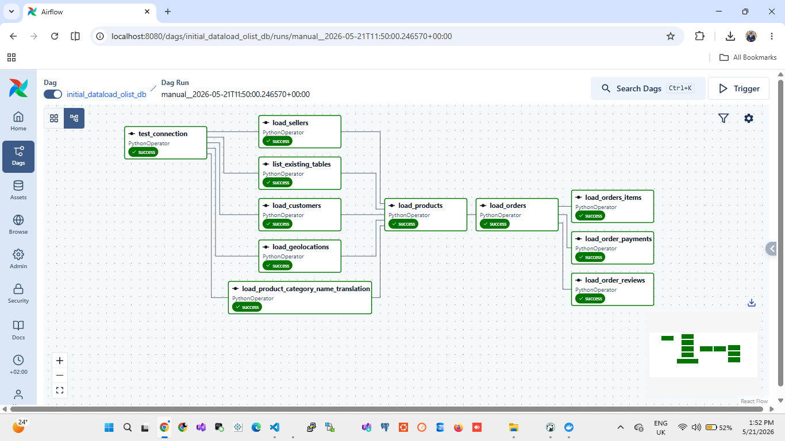
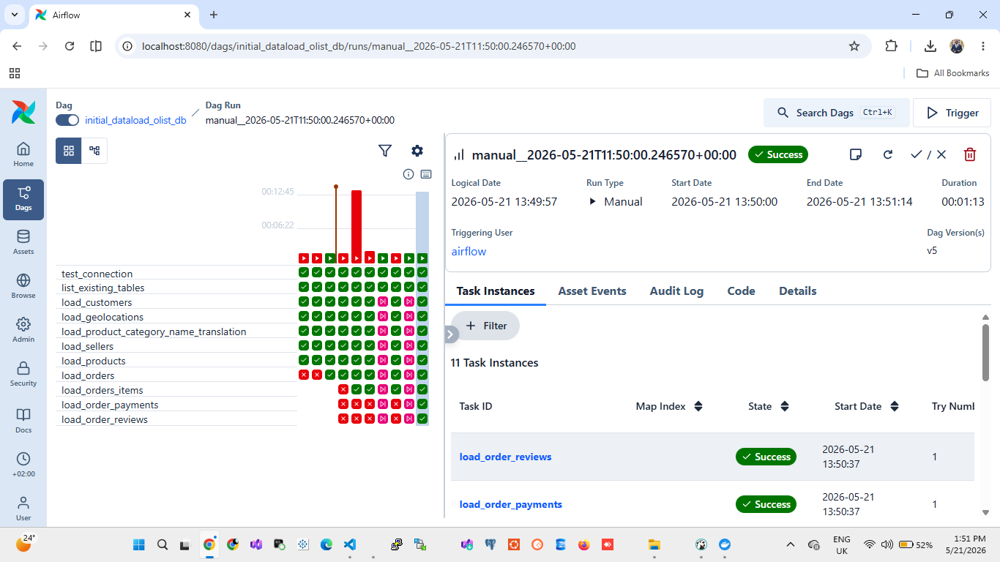

# Olist E-Commerce ETL Pipeline

An end-to-end batch data pipeline built with **Apache Airflow** that ingests the Brazilian Olist e-commerce dataset from CSV files into a **PostgreSQL** data warehouse — with idempotency, deduplication, archiving, and failure notifications built in.

---

## Screenshots


**DAG Graph View**


**DAG Run History**


---

##  Architecture

```
CSV Files (9 datasets)
        │
        ▼
┌───────────────────┐
│   Apache Airflow  │  ← Orchestration & scheduling
│   (PythonOperator)│
└────────┬──────────┘
         │  Validate → Deduplicate → Bulk COPY
         ▼
┌───────────────────┐
│    PostgreSQL     │  ← olist_ecommerce database
│   (olist_db)      │
└───────────────────┘
         │
         ▼
  Processed files → /data/archive/  (timestamped)
┌───────────────────┐
|
|
```

---

##  Dataset

The [Olist Brazilian E-Commerce Dataset](https://www.kaggle.com/datasets/olistbr/brazilian-ecommerce) — 9 relational CSV files covering orders, customers, sellers, products, payments, and reviews.

| File | Loaded Into |
|------|-------------|
| `olist_geolocation_dataset.csv` | `olist_geolocation` |
| `olist_customers_dataset.csv` | `olist_customers` |
| `olist_sellers_dataset.csv` | `olist_sellers` |
| `product_category_name_translation.csv` | `olist_product_category_name_translation` |
| `olist_products_dataset.csv` | `olist_products` |
| `olist_orders_dataset.csv` | `olist_orders` |
| `olist_order_items_dataset.csv` | `olist_order_items` |
| `olist_order_payments_dataset.csv` | `olist_order_payments` |
| `olist_order_reviews_dataset.csv` | `olist_order_reviews` |

---

##  DAG: `initial_dataload_olist_db`

**Schedule:** `@daily` | **Catchup:** Disabled

### Task Flow

```
test_connection
       │
       ├──► list_existing_tables
       ├──► load_geolocations
       ├──► load_customers
       ├──► load_sellers
       └──► load_product_category_name_translation
                         │
                         ▼
                   load_products
                         │
                         ▼
                    load_orders
                         │
              ┌──────────┼──────────┐
              ▼          ▼          ▼
       load_order_  load_order_ load_order_
         reviews    payments     items
```

### What Each Task Does

Every loading task follows the same 6-step pattern:

1. **Read** — Load CSV into a pandas DataFrame
2. **Validate** — Check all required columns are present
3. **Deduplicate** — Drop duplicate rows in-memory
4. **Filter** — Query existing DB keys; exclude already-loaded records
5. **Bulk Insert** — `COPY` into a temp table → `INSERT ... ON CONFLICT DO NOTHING`
6. **Archive** — Move the CSV to `/data/archive/` with a timestamp

---

##  Tech Stack

| Tool | Purpose |
|------|---------|
| Apache Airflow 3.x | Orchestration & scheduling |
| PostgreSQL | Target data warehouse |
| pandas | In-memory data validation & deduplication |
| `PostgresHook` | Airflow-managed DB connections |
| SMTP | Email alerts on task failure |
| Docker (Compose) | Local Airflow environment |

---

##  Getting Started

### Prerequisites

- Docker & Docker Compose
- The Olist CSV files (download from [Kaggle](https://www.kaggle.com/datasets/olistbr/brazilian-ecommerce))

### 1. Clone the repo

```bash
git clone https://github.com/Petermchikho/Data-Portfolio.git
cd Data-Portfolio/Brazilian Ecommerce Dataset
```

### 2. Place CSV files

```bash
cp /path/to/olist/*.csv ./airflow/data/files/
```

### 3. Start Airflow

```bash
cd airflow
docker-compose up -d
```

Airflow UI will be available at `http://localhost:8080`

### 4. Configure Connections

In the Airflow UI go to **Admin → Connections** and add:

| Conn ID | Type | Details |
|---------|------|---------|
| `olist_ecommerce` | Postgres | Your PostgreSQL host, port, db, user, password |
| `smtp_default` | SMTP | Your email server credentials |

### 5. Trigger the DAG

Either wait for the daily schedule or trigger manually:

```bash
airflow dags trigger initial_dataload_olist_db
```

---

## Project Structure

```
airflow/
├── dags/
│   └── initial_dataload.py     # Main DAG definition
├── data/
│   ├── files/                  # Drop CSV files here
│   └── archive/                # Processed files land here
├── images/                     # Screenshots for this README
│   ├── dag_graph.png
│   └── dag_runs.png
├── docker-compose.yml
README.md
```

---

## Key Design Decisions

**Idempotency** — The pipeline can be re-run safely. Existing records are detected and skipped before any insert attempt, so reruns never cause duplicate data.

**Bulk loading via COPY** — Instead of row-by-row inserts, pandas DataFrames are streamed directly into PostgreSQL using `COPY`, then merged with `ON CONFLICT DO NOTHING`. This is orders of magnitude faster than `executemany`.

**File archiving** — Successfully processed CSVs are moved to an `/archive/` folder with a timestamp, preventing accidental reprocessing and providing an audit trail.

**Graceful skips** — If a CSV file is missing, the task raises `AirflowSkipException` rather than failing, so the rest of the DAG continues unaffected.

**Failure notifications** — The DAG-level `on_failure_callback` sends an HTML email with the task name, DAG name, and a direct link to the logs.

---

##  Contact

**Peter Charles Mchikho**
[petercharlesmchikho1@gmail.com](mailto:petercharlesmchikho1@gmail.com)
[GitHub](https://github.com/petermchikho) · [LinkedIn](https://www.linkedin.com/in/peter-mchikho-50146b266/)
